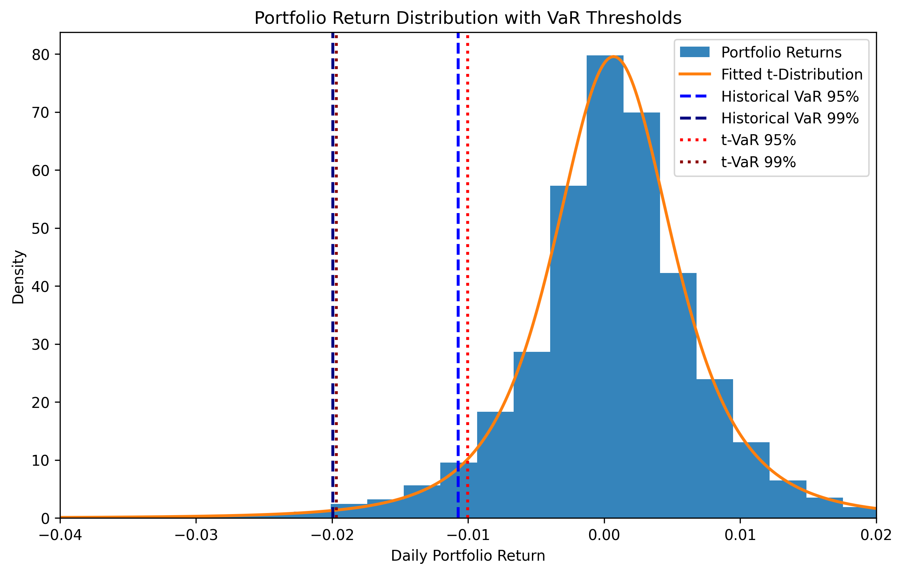

# Multi-Asset Portfolio Risk Analysis (VaR & CVaR)

This project analyzes downside risk in a multi-asset portfolio using Value at Risk (VaR) and Expected Shortfall (CVaR). It compares empirical (historical) risk estimates with model-based estimates using a fitted t-distribution to capture fat-tailed behavior in financial returns.

---

## Overview

Portfolio risk is not only about average volatility, but also about extreme losses in the tail of the return distribution. This project constructs a diversified portfolio and evaluates its downside risk using multiple approaches.

The analysis focuses on:
- Measuring potential losses at different confidence levels
- Comparing historical and parametric risk models
- Understanding the impact of fat tails on risk estimation

## Portfolio

The portfolio consists of a diversified set of ETFs:

- SPY (S&P 500)
- QQQ (NASDAQ)
- XLF (Financials)
- GLD (Gold)
- TLT (Treasury Bonds)

The portfolio is equally weighted across all assets.

## Methods

### 1. Historical Risk Measures
- **Value at Risk (VaR)** at 95% and 99%
- **Expected Shortfall (CVaR)** at 95% and 99%

These are computed directly from the empirical distribution of portfolio returns.

### 2. Parametric Risk (t-Distribution)

- A **t-distribution is fitted** to portfolio returns
- Used to estimate:
  - t-VaR
  - t-CVaR

The t-distribution accounts for **fat tails**, which are commonly observed in financial markets.

## Results

- VaR estimates from the t-distribution are generally close to historical estimates, indicating a reasonable fit
- CVaR is consistently larger than VaR, reflecting the severity of tail losses
- The fitted t-distribution provides a better representation of extreme risk than a normal distribution

## Visualization

The plot below shows:
- The distribution of daily portfolio returns
- Fitted t-distribution
- VaR thresholds at 95% and 99%

## Technologies Used

- Python  
- NumPy  
- Pandas  
- Matplotlib  
- SciPy  
- yFinance  

